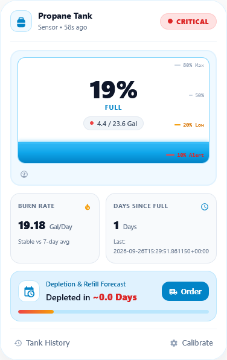
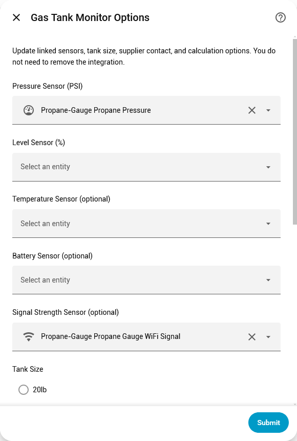

# Gas Tank Monitor

Custom **Home Assistant** integration + **Lovelace card** for LPG / propane cylinders, optimized for **Caribbean 100 lb** tanks (and other common sizes).

Track tank level from a pressure or level sensor, estimate burn rate and days remaining, and forecast when to switch cylinders.

---

## Features

### Integration
- **UI Config Flow** — no YAML required for setup
- Link existing sensors:
  - Pressure (PSI) **or** Level (%)
  - Optional: Temperature, Battery, Signal strength
- **Tank sizes:** 20 / 30 / 40 / **100 lb** (Caribbean default) or custom gallons
- **Temperature-compensated pressure** (optional) — normalizes PSI toward 70°F before converting to %
- **Burn rate history** — rolling samples (3-day rate + 7-day average + trend)
- **Days remaining** until your switch/refill threshold (default 20%)
- **Supplier name & phone** — stored for your records / automations
- **Options screen** — change sensors, tank size, threshold, supplier, and compensation **without reinstalling**

### Sensors created
| Entity | Description |
|--------|-------------|
| `sensor.*_level` | % full + rich attributes |
| `sensor.*_volume_remaining` | Gallons left |
| `sensor.*_burn_rate` | Gal/day (history-based) |
| `sensor.*_days_remaining` | Forecast until threshold |

### Lovelace card (light theme)
Inspired by modern tank monitor UIs (Stitch-style):






- Header with name, battery badge, connection / last-updated
- Status pill: **Optimal** / **Low** / **Critical**
- Large tank gauge with scale marks (80% Max · 50% · 20% Low · 10% Alert)
- Animated liquid fill
- Volume remaining (e.g. `3.2 / 23.6 Gal`)
- Tank temperature & pressure row (when linked)
- Burn rate + days since full
- Depletion forecast
- Footer actions:
  - **Tank History** → entity more-info (graph)
  - **Calibrate** → this integration’s config entry options

---

## Requirements

- Home Assistant **2025.1+** (or recent 2024.x)
- A pressure and/or level sensor entity (e.g. Mopeka, ESPHome, etc.)

---

## Installation

### HACS (recommended)
1. HACS → Integrations → ⋮ → **Custom repositories**
2. Add your GitHub repo URL · Category: **Integration**
3. Download **Gas Tank Monitor**
4. **Restart** Home Assistant

### Manual
1. Copy `custom_components/gas_tank_monitor` into your HA `config/custom_components/` folder
2. Restart Home Assistant

---

## Setup

1. **Settings → Devices & Services → Add Integration → Gas Tank Monitor**
2. Select at least a **Pressure** or **Level** sensor
3. Optionally link temperature, battery, signal
4. Choose tank size (**100 lb** for typical Caribbean household cylinders)
5. Optional: supplier name, phone, temperature compensation

### Change settings later (no reinstall)
**Settings → Devices & Services → Gas Tank Monitor → Configure**

You can update:
- Pressure / Level / Temp / Battery / Signal entities
- Tank size & custom gallons
- Switch recommendation threshold (%)
- Temperature compensate pressure
- Supplier name & phone number

---

## Lovelace card

### Resource (required once if the card does not load)

After install, the integration copies the card to `config/www/gas-tank-card.js`.

**Settings → Dashboards → ⋮ → Resources → Add Resource**

| Field | Value |
|--------|--------|
| URL | `/local/gas-tank-card.js` |
| Type | **JavaScript Module** |

Hard-refresh the browser (`Ctrl+Shift+R` / `Cmd+Shift+R`).

Verify in the browser console:

```js
customElements.get("gas-tank-card")
// should not be undefined — look for: GAS-TANK-CARD 2.2.6
```

Also confirm the file loads:

`http://YOUR-HA:8123/local/gas-tank-card.js`

### Add the card

**Edit dashboard → Add card → Manual** (or search **Gas Tank** under Custom cards when the resource is loaded):

```yaml
type: custom:gas-tank-card
entity: sensor.gas_tank_monitor_level
name: Propane Tank
show_burn_rate: true
show_forecast: true
```

Use the exact entity id shown under your Gas Tank Monitor device (often `sensor.gas_tank_monitor_level` or similar).

### Card options

| Option | Default | Description |
|--------|---------|-------------|
| `entity` | required | Level sensor from this integration |
| `name` | entity name | Title on the card |
| `show_burn_rate` | `true` | Show burn rate metric |
| `show_forecast` | `true` | Show depletion forecast |

### Card actions

| Control | Behavior |
|---------|----------|
| **Tank History** | Opens more-info dialog for the level entity (history graph) |
| **Calibrate** | Opens this config entry’s options (sensors, tank, supplier) |

---

## How level is calculated

1. **Level sensor linked** → that % is used directly (best accuracy, e.g. ultrasonic / Mopeka).
2. **Pressure only** → PSI is mapped through a practical curve; optional **temperature compensation** normalizes pressure toward 70°F before mapping.
3. Pressure readings outside **0–300 psi** are ignored (sensor glitch protection).

> LPG vapor pressure is strongly temperature-dependent. For best results use a true level sensor; pressure-only mode is an approximation for household monitoring.

### Burn rate & forecast
- Level samples are stored about every 15 minutes (restored after restart).
- **Burn rate** prefers a ~3-day sample window; falls back to “since last full”.
- **7-day average** and trend (`+X% vs 7-day avg`) appear when enough history exists.
- **Days remaining** = usable gallons until your threshold ÷ burn rate.

---

## File layout

```
gas_tank_monitor_repo/
├── hacs.json
├── README.md
├── LICENSE
├── CARD_INSTALL.md
├── www/
│   └── gas-tank-card.js          # copy target for /local/ fallback
└── custom_components/
    └── gas_tank_monitor/
        ├── __init__.py           # static path, /local copy, card inject
        ├── manifest.json
        ├── const.py
        ├── config_flow.py        # setup + full options (sensors editable)
        ├── sensor.py
        ├── strings.json
        ├── translations/en.json
        └── www/
            └── gas-tank-card.js  # Lovelace card
```

---

## Troubleshooting

### Card: “Custom element doesn't exist: gas-tank-card”
0. **Developer Tools → Services → `gas_tank_monitor.register_card`** then hard-refresh  

1. Restart HA after install  
2. Open `/local/gas-tank-card.js` in the browser — must show JS, not 404  
3. Add resource `/local/gas-tank-card.js` as **JavaScript Module**  
4. Hard-refresh browser  
5. Console: `customElements.get("gas-tank-card")`

### Options missing sensor pickers
Update to **1.4.9+**, restart, open **Configure** again. You should see Pressure / Level / Temp / Battery / Signal at the top.

### Burn rate shows “—”
Normal until there is history: either a recent “full” (≥95%) event or several hours of level samples. It fills in automatically over time.

---

## Version

| Component | Version |
|-----------|---------|
| Integration | **1.4.9** |
| Lovelace card | **2.2.6** |

---

## License

MIT
